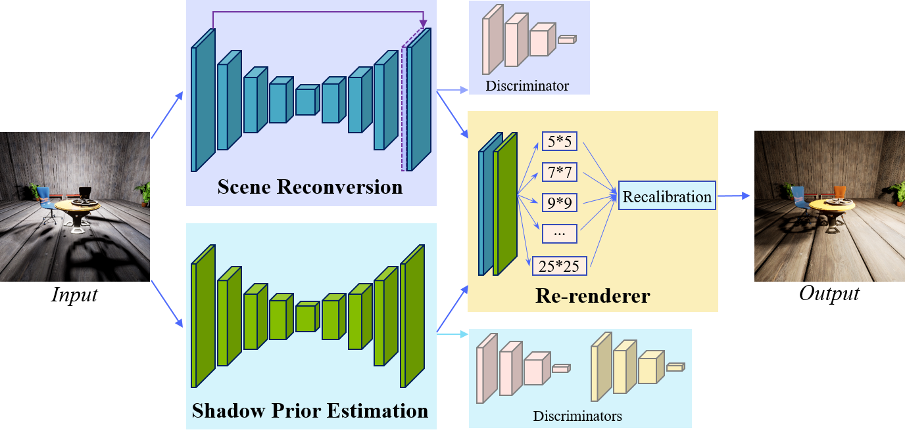

# Deep Relighting Network (DRN) for Image Light Source Manipulation
### Team: DeepRelight
#### Members: Li-Wen Wang, Zhi-Song Liu, Chu-Tak Li,Wan-Chi Siu, Daniel P. K. Lun
It contains the codes to attend AIM 2020 Relighting Challenge Track 1: One-to-one relighting

Our testing result can be found from [here](https://drive.google.com/file/d/1w5-XPb3prHha2ens0rrIPeLafB--4g6S/view?usp=sharing) (google drive link)




## Prerequisites
- Linux
- Python 3
- NVIDIA GPU (11G memory or larger) + CUDA cuDNN

## Getting Started
### Installation
- Install PyTorch and dependencies from http://pytorch.org
- Install python libraries [dominate](https://github.com/Knio/dominate).
```bash
pip install dominate, kornia
pip install git+https://github.com/S-aiueo32/lpips-pytorch.git
```
- Clone this repo


### Testing
- A few example test images are included in the `datasets/test` folder.
- Please download trained model
  - Generator from [here](https://drive.google.com/file/d/1HoyYtG6fNIw_45qbe8QrENXNPKYZmMcu/view?usp=sharing) (google drive link)
  - Discriminator from [here](https://drive.google.com/file/d/195WH6LpARtnZPkaDDq_Def9t5fA0p8Qa/view?usp=sharing) (google drive link)
  - Put them under `./checkpoints/best_model/`
- Test the model:
```bash
python test.py
```
The test results will be saved to the folder: `./output`.


### Dataset
- We use the VIDIT dataset (track 3). To train a model on the full dataset, please download it first.
- We generate the wide-range images (through the OpenCV package) to supervise the scene reconversion network, please download it from [here](https://drive.google.com/file/d/16tW_3CYNmks7R3NJany31TXeOiiEZrIw/view?usp=sharing)

After downloading, please put them under the `datasets` folder, which are "datasets/track3_train" and "datasets/track3_HDR"


### Training
- Train a model at 512 x 512 resolution:
```bash
python train.py 
```
The training process includes three stages: Firstly, we trained the scene reconversion using paired input and wide-range target, accompanied with the discriminators. Secondly, we trained the shadow prior estimation network by paired input and target images with the other discriminators. Finally, we fixed the shadow prior estimation and trained the whole DRN with paired input and target images, using Laplace and VGG (*0.01) losses. The training images are resized to 512x512 because of the limitation of the GPU memory. All stages uses the Adam optimization with momentum 0.5 and learning rate 0.0002. 

## Acknowledgments
This code borrows heavily from [pytorch-CycleGAN-and-pix2pix](https://github.com/junyanz/pytorch-CycleGAN-and-pix2pix).
